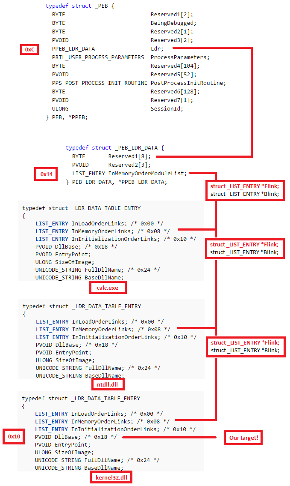
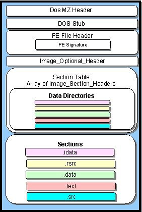
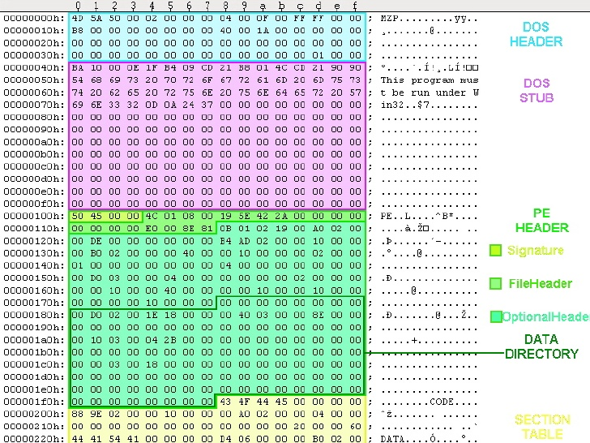
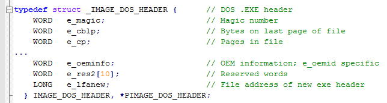

# Extracting DLL Addresses in Shellcode using PEB Structures

## Purpose

When writing shellcode, fixed memory addresses for DLL functions like `GetProcAddress` or `LoadLibrary` cannot be relied upon due to **ASLR (Address Space Layout Randomization)**. Instead, one must locate these DLLs (such as `kernel32.dll`) by navigating fixed memory structures — specifically, the **PEB (Process Environment Block)**.

This article outlines how to traverse these structures to locate DLL base addresses and exported functions.

---

## Step-by-Step Navigation from PEB to Exported Functions

### 1. Read the PEB Structure

In shellcode, the PEB is accessed through the TEB (Thread Environment Block). On 32-bit systems, the FS segment register is used:

```assembly
mov eax, fs:[0x30]  ; Get PEB base address
```

### 2. From PEB to `PEB_LDR_DATA`

Partial definition of the PEB structure:

```c
typedef struct _PEB {
    BYTE Reserved1[12];    // 0x0 - 0xB
    PPEB_LDR_DATA Ldr;     // 0xC - 0xF
} PEB;
```

`Ldr` resides at offset **0x0C** within the PEB.

```assembly
mov eax, fs:[0x30]      ; Get PEB
mov eax, [eax + 0x0C]   ; Get PEB->Ldr
```

### 3. Access `InMemoryOrderModuleList`

Definition of `PEB_LDR_DATA`:

```c
typedef struct _PEB_LDR_DATA {
    BYTE       Reserved1[8];
    PVOID      Reserved2[3];
    LIST_ENTRY InMemoryOrderModuleList; // Offset 0x14
} PEB_LDR_DATA, *PPEB_LDR_DATA;
```

Access the `InMemoryOrderModuleList`:

```assembly
mov eax, [eax + 0x14]   ; Get InMemoryOrderModuleList
```

`LIST_ENTRY` structure:

```c
typedef struct _LIST_ENTRY {
    struct _LIST_ENTRY *Flink;
    struct _LIST_ENTRY *Blink;
} LIST_ENTRY;
```

> 💡 **InMemoryOrderModuleList** points to the **InMemoryOrderLinks** of a **LDR_DATA_TABLE_ENTRY**, not the start of the structure.

### 4. Traversing Loaded DLLs

Updated traversal logic using `esi`:

```assembly
xor ecx, ecx
mov eax, fs:[ecx + 0x30]  ; EAX = PEB
mov eax, [eax + 0xc]      ; EAX = PEB->Ldr
mov esi, [eax + 0x14]     ; ESI = PEB->Ldr.InMemOrder
lodsd                     ; EAX = Second module
xchg eax, esi             ; EAX = ESI, ESI = EAX
lodsd                     ; EAX = Third(kernel32)
mov ebx, [eax + 0x10]     ; EBX = Base address
```

The loading order typically is:

1. Executable (e.g., calc.exe)
2. ntdll.dll
3. kernel32.dll ✅ (target)

To access the full `LDR_DATA_TABLE_ENTRY` structure, backtrack from `InMemoryOrderLinks`:

```c
typedef struct _LDR_DATA_TABLE_ENTRY {
    LIST_ENTRY InMemoryOrderLinks; // +0x0
    PVOID      Reserved1[2];
    PVOID      DllBase;            // +0x10
    ...
} LDR_DATA_TABLE_ENTRY;
```

* `DllBase` gives the base address of the DLL.

To retrieve it, subtract 0x0 and then read +0x10:



---

## PE Format: Finding Exported Functions



The `DllBase` marks the beginning of the PE structure.

### PE File Structure

A PE file contains:

- DOS header
- DOS stub (displays "This program cannot be run in DOS mode")
- PE headers
- Section table
- Sections (code/data)



Start with the DOS header:



Recognized by its first two bytes `"MZ"` in the `e_magic` field. Of interest is the `e_lfanew` field at offset 0x3C, which gives the location of the PE header.

### PE Header Offsets of Interest

* **e_lfanew**: Offset to PE Header

```assembly
mov eax, [dll_base + 0x3C]   ; e_lfanew
add eax, dll_base            ; PE header address
```

From here, navigate to the Optional Header:

### Inside Optional Header


Key fields:

- `AddressOfEntryPoint`: Entry point for code execution
- `ImageBase`: Base memory location of the DLL
- `DataDirectory[0]`: Export directory (offset **0x78**)

```assembly
mov eax, [pe_header + 0x78]  ; RVA of Export Directory
add eax, dll_base            ; Actual address
```

### IMAGE_DATA_DIRECTORY

The export directory holds exported functions like `LoadLibrary` or `GetProcAddress`.

```c
typedef struct _IMAGE_DATA_DIRECTORY {
    DWORD VirtualAddress;
    DWORD Size;
} IMAGE_DATA_DIRECTORY;
```

At offset 0x78 from the start of the PE header is the first `IMAGE_DATA_DIRECTORY` — the Export Directory.

---

## Reading Export Directory

`IMAGE_EXPORT_DIRECTORY` structure:

```c
typedef struct _IMAGE_EXPORT_DIRECTORY {
    DWORD Characteristics;
    DWORD TimeDateStamp;
    WORD  MajorVersion;
    WORD  MinorVersion;
    DWORD Name;
    DWORD Base;
    DWORD NumberOfFunctions;
    DWORD NumberOfNames;
    DWORD AddressOfFunctions;     // RVA to function pointers
    DWORD AddressOfNames;         // RVA to names
    DWORD AddressOfNameOrdinals;  // RVA to ordinals
} IMAGE_EXPORT_DIRECTORY;
```

Use the following fields:

- `AddressOfFunctions`: RVA array of function pointers
- `AddressOfNames`: RVA array of function name pointers
- `AddressOfNameOrdinals`: RVA array of function ordinals

Example:

```
AddressOfFunctions     = 0x11223344 —> [0x11111111, 0x22222222, 0x33333333]
AddressOfNames         = 0x12345678 —> [0xaaaaaaaa -> "func0", 0xbbbbbbbb -> "func1", 0xcccccccc -> "func2"]
AddressOfNameOrdinals  = 0xabcdef    —> [0x00, 0x01, 0x02]
```

To find the address of `func1`:

1. Find index in `AddressOfNames`
2. Fetch ordinal at same index in `AddressOfNameOrdinals`
3. Use ordinal to get address from `AddressOfFunctions[ordinal]`

---

**Reference**: [SecurityCafe - Introduction to Windows Shellcode Development Part 2](https://securitycafe.ro/2015/12/14/introduction-to-windows-shellcode-development-part-2/)
