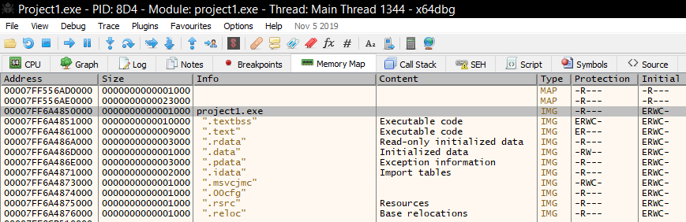

# x64dbg (xdbg) - Overview and Memory/Register Sections

## Introduction

**x64dbg**, often abbreviated as **xdbg**, is a free and open-source debugger for Windows executables. It is widely used in reverse engineering, malware analysis, and software cracking.

---

## Components / Sections

### CPU

The CPU executes instructions and is responsible for running software by processing machine-level operations.

### Memory

Memory holds various storage sections essential for running software:

| Section          | Description                                                                                                           |
| ---------------- | --------------------------------------------------------------------------------------------------------------------- |
| `.text`          | Stores actual compiled code (machine instructions)                                                                    |
| `.data`          | Stores initialized global/static variables                                                                            |
| `.bss`           | Stores uninitialized global/static variables (default to zero)                                                        |
| **Heap**         | Stores dynamically allocated memory at runtime (e.g., via `malloc()`, `new`)   Example: `char *name = malloc(50);` |
| **Stack**        | Stores function call frames, local variables, and return addresses                                                    |
| **Mapped Files** | Memory regions mapped from external files (DLLs, EXEs, etc.)                                                          |
| **Reserved**     | Reserved address space by OS or program but not yet committed                                                         |

---

## Register Section

The register section shows live updates of CPU registers as the program is debugged.

### Types of Registers

1. **General Purpose Registers**
   Used for arithmetic, data movement, and logical operations:
   `RAX`, `RBX`, `RCX`, `RDX`, `RSI`, `RDI`, `RBP`, `RSP`, `R8`–`R15`

2. **Segment Registers**
   Hold segment selectors to access different memory segments:

   * `CS` — Code Segment
   * `DS` — Data Segment
   * `SS` — Stack Segment
   * `ES`, `FS`, `GS` — Extra Segments

3. **Instruction Pointer Register (`RIP`)**
   Holds the address of the next instruction to be executed.

4. **Flags / Status Register**
   Contains bit flags describing CPU state after operations:
   Examples include: `CF` (Carry Flag), `ZF` (Zero Flag), `SF` (Sign Flag), `OF` (Overflow Flag), `PF` (Parity Flag)

---

## CPU Register Size Notation (x86-64)

| 64-bit (QWORD) | 32-bit (DWORD) | 16-bit (WORD) | 8-bit (BYTE)                 | Size              |
| -------------- | -------------- | ------------- | ---------------------------- | ----------------- |
| **RAX**        | **EAX**        | **AX**        | **AH** (high) / **AL** (low) | 8 bytes (64 bits) |
| **RBX**        | **EBX**        | **BX**        | **BH** / **BL**              | 4 bytes (32 bits) |
| **RCX**        | **ECX**        | **CX**        | **CH** / **CL**              | 2 bytes (16 bits) |
| **RDX**        | **EDX**        | **DX**        | **DH** / **DL**              | 1 byte (8 bits)   |
| **RSI**        | **ESI**        | **SI**        | **SIL**                      | 8 bytes (64 bits) |
| **RDI**        | **EDI**        | **DI**        | **DIL**                      | 4 bytes (32 bits) |
| **RBP**        | **EBP**        | **BP**        | **BPL**                      | 2 bytes (16 bits) |
| **RSP**        | **ESP**        | **SP**        | **SPL**                      | 1 byte (8 bits)   |
| **R8**         | **R8D**        | **R8W**       | **R8B**                      | 8/4/2/1 bytes     |
| **R9**         | **R9D**        | **R9W**       | **R9B**                      | 8/4/2/1 bytes     |
| ...            | ...            | ...           | ...                          | ...               |

---

### Notes

* **QWORD** = Quad Word = 8 bytes = 64 bits

* **DWORD** = Double Word = 4 bytes = 32 bits

* **WORD** = Word = 2 bytes = 16 bits

* **BYTE** = Byte = 1 byte = 8 bits

* For registers like `RAX`, the lowest 16 bits form `AX`, which is further divided into `AL` (lower 8 bits) and `AH` (higher 8 bits of AX).

* For registers `R8` to `R15`, only the lowest byte is named (e.g., `R8B`); they do not have a high 8-bit half-register.

---

## Stack Section

Displays the current function call stack, showing call frames, local variables, and return addresses.

